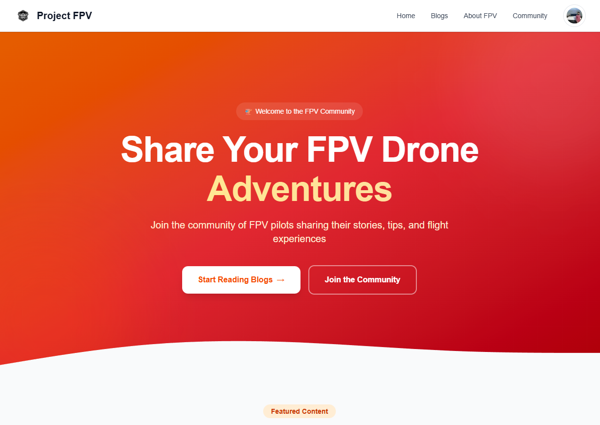

# Project FPV 

## Live Link 
 https://project-fpv-next-client.vercel.app

## Backend GitHub repo :
https://github.com/XDR-SAM/PROJECT-FPV-EXPRESS-SERVER.git

## Prerequisites

- Node.js 18+ installed
- Firebase project with Authentication enabled
- Express backend server with Firebase Admin SDK (deployed on Vercel)

## Environment Variables

Create a `.env.local` file in the root directory with the following variables:

```env
# Firebase Client SDK Configuration
NEXT_PUBLIC_FIREBASE_API_KEY=your-firebase-api-key
NEXT_PUBLIC_FIREBASE_AUTH_DOMAIN=your-project.firebaseapp.com
NEXT_PUBLIC_FIREBASE_PROJECT_ID=your-project-id
NEXT_PUBLIC_FIREBASE_STORAGE_BUCKET=your-project.firebasestorage.app
NEXT_PUBLIC_FIREBASE_MESSAGING_SENDER_ID=your-sender-id
NEXT_PUBLIC_FIREBASE_APP_ID=your-app-id

# Backend API URL
NEXT_PUBLIC_API_URL=https://your-express-server.vercel.app/api
```

## Installation

1. Install dependencies:
```bash
npm install
```

## Running the Application

1. Make sure your Express backend server is running (or deployed on Vercel)
2. Start the Next.js development server:
```bash
npm run dev
```

3. Open [http://localhost:3000](http://localhost:3000) in your browser

## Project Structure

```
src/
├── app/
│   ├── layout.js              # Root layout with Navbar & Footer
│   ├── page.js                # Landing page
│   ├── login/
│   │   └── page.js            # Login/Register page (Firebase Auth)
│   ├── blogs/
│   │   ├── page.js            # Blog list page
│   │   └── [id]/
│   │       └── page.js        # Blog details page
│   ├── create-blog/
│   │   └── page.js            # Create blog (protected)
│   ├── my-blogs/
│   │   └── page.js            # My blog posts (protected)
│   ├── about/
│   │   └── page.js            # About FPV page
│   └── community/
│       └── page.js            # Community page
├── components/
│   ├── Navbar.js              # Navigation bar
│   ├── Footer.js              # Footer component
│   ├── BlogCard.js            # Reusable blog card
│   ├── ProtectedRoute.js      # Auth protection wrapper
│   └── Providers.js           # Auth provider wrapper
└── lib/
    ├── firebase.js            # Firebase client configuration
    ├── AuthContext.js         # Firebase Auth context provider
    └── api.js                 # API client for Express backend
```

## Features

-  Firebase Google OAuth authentication
-  Firebase Email/Password authentication
-  Blog post creation, reading, and management
-  Like functionality
-  Search and filter blogs
-  Category-based organization
-  Responsive design
-  Protected routes

## Firebase Authentication Flow

1. User authenticates via Firebase (Google or Email/Password)
2. Firebase issues an ID token
3. Frontend sends the ID token to the Express backend
4. Backend verifies the token using Firebase Admin SDK
5. Backend creates/syncs user in MongoDB
6. All subsequent API requests include the Firebase ID token

## API Endpoints Used

The frontend communicates with the Express backend:

- `POST /api/auth/sync` - Sync Firebase user with MongoDB (protected)
- `GET /api/auth/me` - Get current user (protected)
- `GET /api/auth/verify` - Verify token (protected)
- `GET /api/blogs` - Get all blogs (with filters)
- `GET /api/blogs/:id` - Get single blog
- `POST /api/blogs` - Create blog (protected)
- `PUT /api/blogs/:id` - Update blog (protected)
- `DELETE /api/blogs/:id` - Delete blog (protected)
- `GET /api/blogs/user/my-posts` - Get user's blogs (protected)
- `POST /api/blogs/:id/like` - Like/Unlike blog (protected)
- `GET /api/stats` - Get community stats
- `GET /api/categories` - Get category counts

## Troubleshooting

### Authentication Issues
- Make sure Firebase configuration is correct
- Verify the Firebase project has Authentication enabled
- Check that Google sign-in is enabled in Firebase Console

### API Connection Issues
- Ensure the backend server is running or deployed
- Check `NEXT_PUBLIC_API_URL` in `.env.local`
- Verify CORS is enabled on the backend

### Image Loading Issues
- External images are allowed via Next.js config
- Make sure image URLs are valid and accessible

## Building for Production

```bash
npm run build
npm start
```

## Deploying to Vercel

1. Push your code to GitHub
2. Import the project in Vercel
3. Add the following environment variables in Vercel:
   - `NEXT_PUBLIC_FIREBASE_API_KEY`
   - `NEXT_PUBLIC_FIREBASE_AUTH_DOMAIN`
   - `NEXT_PUBLIC_FIREBASE_PROJECT_ID`
   - `NEXT_PUBLIC_FIREBASE_STORAGE_BUCKET`
   - `NEXT_PUBLIC_FIREBASE_MESSAGING_SENDER_ID`
   - `NEXT_PUBLIC_FIREBASE_APP_ID`
   - `NEXT_PUBLIC_API_URL`
4. Deploy!
